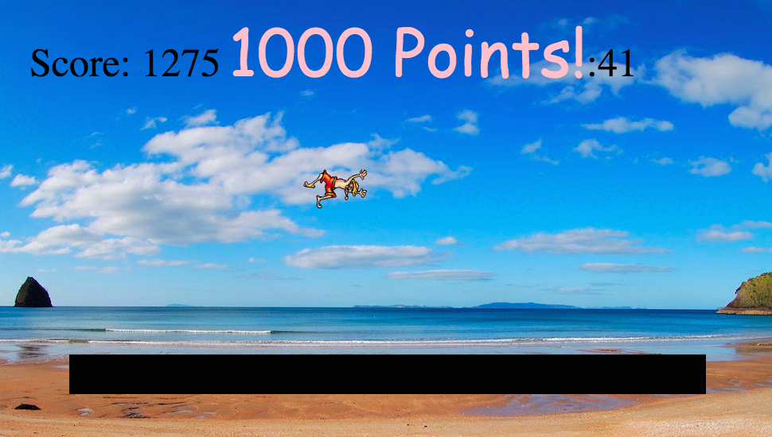

# [BounceAround](http://zgavin1.github.io/BounceAround)

## Overview
In order to explore and learn about HTML5, CSS, and the canvas, I built this awesome trampoline game. The major components of the game are handled with JavaScript, and a little jQuery.

The objective is to time your bounces (releasing the spacebar) with the trampoline itself, and spin (left and right arrows) to rack up the points.

## Features
### HTML5 Canvas
I use native HTML methods to grab the canvas and draw the game pieces on the screen

### Jumper
The jumper is a sprite with two states, crouched and uncrouched, in which I display different coordinates of the sprite sheet.

The jumper's position on the canvas and velocity are calculated with vector mathematics, based on a 'gravity' component.

### The Bounce
When the game enters the state of 'isBouncing', both the trampoline and jumper components react.
The jumper has his velocity reversed and multiplied by a certain coefficient dependent on whether they have timed their "jump" correctly.

The 'isBouncing' state depends on the position of the jumper being within a certain small distance from the top of the trampoline. The perspective sees the jumper sink into the trampoline to mimic a real life trampoline user sinking in when they bounce in the middle.

I included the [keymaster][https://github.com/madrobby/keymaster] library for keypresses because it provided an easier way to handle the different functions of holding the spacebar and releasing it than native HTML methods.

### The Trampoline
The trampoline sits near the bottom of the canvas and reacts to the isBouncing state of the game with recoil. It is also calculated with vector equations. 

### The Skycam
If the position value of the jumper exceeds the top of the canvas (is below 0), the jumper is drawn to the side in a box called SkyCam, along with his current altitude, so that users can time their next jump with the descent.

$$$ The ScoreBoard and Timer
Both the Score and the Timer are JavaScript classes included in the game to keep track of these vital pieces of information. The score is animated when a player hits each increment of 1000 points and the timer is animated for the final 10 seconds.